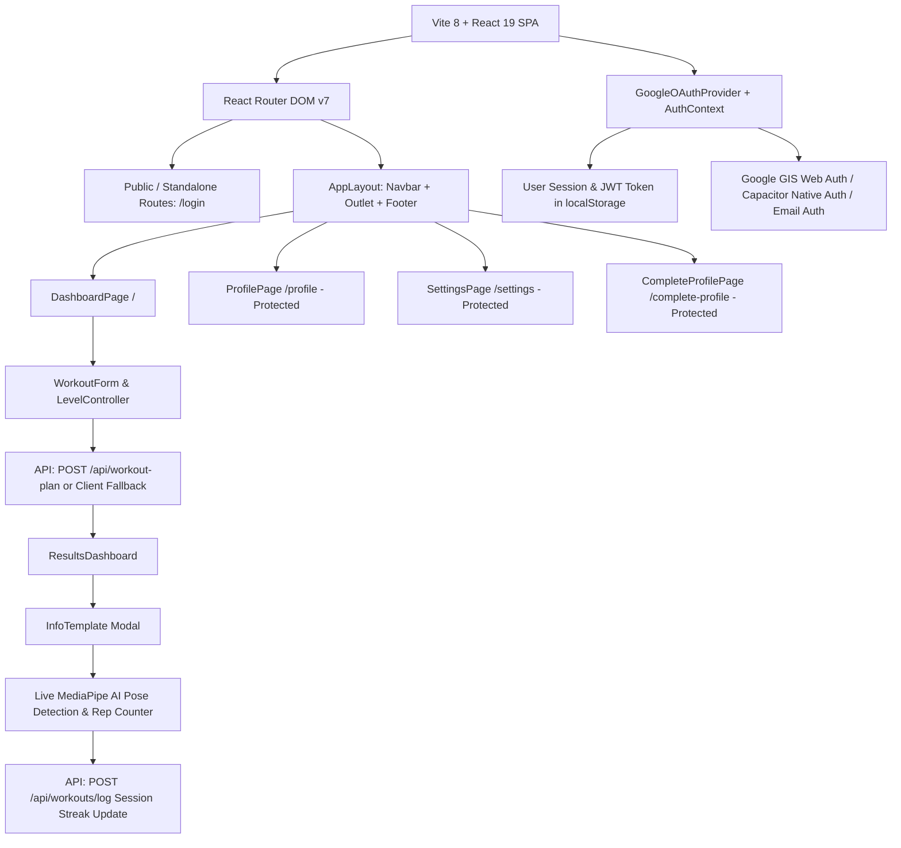
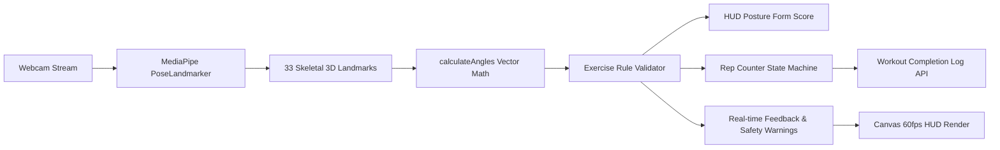

# The Gym Bro — Frontend Architecture & Handoff Specification

This document provides a comprehensive, production-grade architectural breakdown of **The Gym Bro** frontend. It serves as the primary technical context for external UI redesign workflows (such as Stitch and 21st.dev component integrations) and guarantees that all existing business logic, authentication flows, backend API contracts, AI computer vision systems, and responsive requirements remain 100% intact during future UI implementations.

---

## 1. Complete Frontend Architecture Overview



### Core Tech Stack
* **Framework**: [React 19](file:///c:/Users/GOURAV%20GABA/Downloads/the%20gym%20bro/package.json#L23) (`19.2.6`)
* **Build Tool & Bundler**: [Vite 8](file:///c:/Users/GOURAV%20GABA/Downloads/the%20gym%20bro/package.json#L37) (`8.0.12`) with `@vitejs/plugin-react` (`6.0.1`)
* **Programming Language**: Modern JavaScript (ES Modules, JSX, Standard ECMAScript 2024+)
* **Routing**: [React Router DOM v7](file:///c:/Users/GOURAV%20GABA/Downloads/the%20gym%20bro/package.json#L25) (`7.18.1`) with nested layout routes (`<AppLayout />` + `<Outlet />`)
* **Styling System**: [Tailwind CSS v4](file:///c:/Users/GOURAV%20GABA/Downloads/the%20gym%20bro/package.json#L26) (`4.3.1`) via `@tailwindcss/vite` paired with custom CSS design tokens in [src/index.css](file:///c:/Users/GOURAV%20GABA/Downloads/the%20gym%20bro/src/index.css)
* **Icon Library**: [lucide-react](file:///c:/Users/GOURAV%20GABA/Downloads/the%20gym%20bro/package.json#L22) (`1.25.0`) + custom inline optimized SVG icons
* **Authentication**: 
  - Web: [@react-oauth/google](file:///c:/Users/GOURAV%20GABA/Downloads/the%20gym%20bro/package.json#L20) (`0.13.5`) with Google Identity Services (GIS) / `useGoogleLogin`
  - Mobile/Native: [@codetrix-studio/capacitor-google-auth](file:///c:/Users/GOURAV%20GABA/Downloads/the%20gym%20bro/package.json#L18) (`3.4.0-rc.4`) with [@capacitor/core](file:///c:/Users/GOURAV%20GABA/Downloads/the%20gym%20bro/package.json#L17) (`8.4.2`)
  - Email / Password / Local Demo Authentication
* **Computer Vision & AI Tracking**: [@mediapipe/tasks-vision](file:///c:/Users/GOURAV%20GABA/Downloads/the%20gym%20bro/package.json#L19) (`0.10.35`) via `PoseLandmarker` for real-time camera-based skeletal tracking, posture analysis, and automatic rep counting
* **State Management**: React Context API ([AuthContext.jsx](file:///c:/Users/GOURAV%20GABA/Downloads/the%20gym%20bro/src/context/AuthContext.jsx)) + React Component State (`useState`, `useRef`, `useEffect`) + `localStorage` persistence
* **API Communication**: Native `fetch` with centralized base URL configuration in [src/config/api.js](file:///c:/Users/GOURAV%20GABA/Downloads/the%20gym%20bro/src/config/api.js) and seamless client fallback modules
* **Typography**: Google Fonts (`Inter`, `Outfit`, `Plus Jakarta Sans`)
* **Theme**: Deep Dark Theme (`#060913` main / `#121212` auth / `#1e1e1e` cards / `#ff4b2b` energetic orange-red athletic accents)

---

## 2. Complete Frontend Directory Structure

```text
src/
├── assets/                       # Static bundled images and logos
│   ├── hero.png                  # Brand hero banner illustration
│   ├── react.svg                 # React identity asset
│   └── vite.svg                  # Vite identity asset
├── components/                   # Reusable UI components and feature widgets
│   ├── profile/                  # User profile and settings widgets
│   │   ├── Achievements.jsx      # Milestones & badges display card
│   │   ├── EditProfileModal.jsx  # Full profile editor modal (metrics & goals)
│   │   ├── ExercisePreferences.jsx# Target workout & activity level card
│   │   ├── PersonalInformation.jsx# Age, gender, height, weight, bio card
│   │   ├── ProfileHeader.jsx     # Athlete banner, verified status, quick stats
│   │   ├── SettingsCard.jsx      # Dark mode toggles, alerts & account deletion
│   │   └── WorkoutStats.jsx      # 4-card statistics grid (streak, workouts, goal)
│   ├── ui/                       # Clean directory for future primitive UI components (buttons, dialogs, inputs)
│   ├── AuthModal.jsx             # Standalone & modal auth card (Email + Google)
│   ├── LevelController.jsx       # Conditional experience level selector (Days/Muscles)
│   ├── Navbar.jsx                # Top app navbar with user avatar menu & mobile drawer
│   ├── ProtectedRoute.jsx        # Auth & profile-completion route guard
│   ├── ResultsDashboard.jsx      # Generated split viewer with 4-col table & mobile cards
│   ├── SkeletonLoader.jsx        # Loading skeleton placeholders
│   ├── Spinner.jsx               # Generator loading state indicator
│   ├── Template.jsx              # Development placeholder stub
│   ├── ToastNotification.jsx     # Global floating toast alert system
│   ├── WorkoutForm.jsx           # Interactive 4-step workout generator form
│   ├── cameraupload.jsx          # File/Video upload handler with preview
│   ├── infopage.jsx              # Full-screen modal movement guide (Portal)
│   └── posedet.jsx               # MediaPipe camera HUD, angle math & rep counter
├── config/
│   └── api.js                    # Base API URL resolver (with fallback to cloud endpoint)
├── context/
│   └── AuthContext.jsx           # Global Auth Provider (sessions, tokens, profile, toasts)
├── data/
│   └── exerciseDetails.js        # Offline database for exercise guides, steps, tips
├── exerciseRules/                # Biomechanical posture rules & rep counting logic
│   ├── benchPress.js             # Bench press angles, lockout & elbow flare checks
│   ├── bicepCurl.js              # Bicep curl inflection tracking & elbow stabilization
│   ├── generic.js                # Universal movement fallback tracker
│   ├── index.js                  # Exercise name to rule dispatcher
│   ├── latPulldown.js            # Lat pulldown torso angle & bar path tracking
│   ├── romanianDeadlift.js       # RDL hip hinge, spinal neutrality & knee flexion
│   ├── shoulderPress.js          # Overhead press overhead lockout & arch detection
│   ├── squat.js                  # Back squat depth (femur parallel), knee tracking
│   └── tricepPushdown.js         # Tricep extension lockout & elbow drift detection
├── pages/                        # Page-level view components
│   ├── CompleteProfilePage.jsx   # Onboarding form for mandatory athlete metrics
│   ├── DashboardPage.jsx         # Primary generator & workout split dashboard
│   ├── LoginPage.jsx             # Full-viewport standalone login screen
│   ├── ProfilePage.jsx           # Athlete profile view with stats & badges
│   └── SettingsPage.jsx          # Application preferences & account settings
├── pose/                         # Geometric & algorithmic vision utilities
│   ├── angleUtils.js             # 2D/3D joint vector angle calculations
│   ├── feedbackEngine.js         # Real-time verbal/visual coaching cue generator
│   ├── landmarkUtils.js          # MediaPipe 33-landmark point extraction & visibility
│   ├── postureEvaluator.js       # High-level form score & safety validator
│   └── repCounter.js             # State machine for concentric/eccentric rep counting
├── utils/
│   └── workoutGenerator.js       # Dynamic client-side workout plan generator fallback
├── App.css                       # Minimal CSS stub
├── App.jsx                       # Root app router, layout definitions & providers
├── index.css                     # Global styles, Tailwind v4 tokens & custom CSS rules
└── main.jsx                      # React DOM root bootstrapping
```

### Directory Redesign Guidance
* **Safe to Redesign & Replace**: `src/pages/*`, `src/components/profile/*`, `src/components/WorkoutForm.jsx`, `src/components/LevelController.jsx`, `src/components/ResultsDashboard.jsx`, `src/components/Navbar.jsx`, `src/components/ToastNotification.jsx`, `src/components/SkeletonLoader.jsx`, `src/components/Spinner.jsx`, `src/index.css`.
* **Must Preserve Logic (Refactor Visual Shell Only)**: `src/components/AuthModal.jsx`, `src/components/infopage.jsx`, `src/components/posedet.jsx`, `src/components/cameraupload.jsx`, `src/components/ProtectedRoute.jsx`.
* **DO NOT MODIFY (Core Business Logic / Vision Engine / Config)**: `src/context/AuthContext.jsx`, `src/config/api.js`, `src/exerciseRules/*`, `src/pose/*`, `src/utils/workoutGenerator.js`, `src/data/exerciseDetails.js`.

---

## 3. Detailed Page & Route Manifest

### Route 1: `/login` (Standalone Public Route)
* **Component**: [LoginPage.jsx](file:///c:/Users/GOURAV%20GABA/Downloads/the%20gym%20bro/src/pages/LoginPage.jsx) rendering [AuthModal.jsx](file:///c:/Users/GOURAV%20GABA/Downloads/the%20gym%20bro/src/components/AuthModal.jsx)
* **Auth Requirement**: Public (If already logged in, automatically redirects to `/dashboard` or `/complete-profile`).
* **Layout**: **Standalone full-viewport** (`min-h-100dvh`). Does **NOT** render `Navbar` or `Footer`.
* **UI Structure**:
  1. Full-screen background (`#121212` with subtle radial lighting).
  2. Centered auth card (`max-w-[440px]`, `rounded-[40px]`, `#1e1e1e`, border `rgba(255,255,255,0.05)`).
  3. Circular barbell logo badge (`w-16 h-16`, `bg-white/10`).
  4. Heading: "The Gym Bro".
  5. Email input & Password input (`bg-[#2a2a2a]`, `rounded-2xl`).
  6. "Continue with Google" button with official 4-color Google vector logo.
  7. Footer security notice: "Secure authentication powered by Google".
* **User Interactions**:
  - Type email/password $\rightarrow$ hit Enter or click submit $\rightarrow$ calls `loginWithEmail(email, password)`.
  - Click "Continue with Google" $\rightarrow$ triggers Google GIS popup or Capacitor native GoogleAuth $\rightarrow$ calls `loginWithGoogle(credentialOrProfile)`.
* **States**: Initial, Loading (`loading = true`, button disabled), Error (Toast notification), Success (Redirects).
* **Responsive Behavior**: Fluid `100%` width with `max-width: 440px`. On mobile ($\le 480\text{px}$), padding reduces to `32px 20px`, border radius scales to `28px`, input heights $\ge 52\text{px}$.

---

### Route 2: `/` and `/dashboard` (Primary Workout Generator)
* **Component**: [DashboardPage.jsx](file:///c:/Users/GOURAV%20GABA/Downloads/the%20gym%20bro/src/pages/DashboardPage.jsx)
* **Auth Requirement**: Public to generate and view splits; logging completed workout sessions prompts Google login.
* **Layout**: Rendered inside [AppLayout](file:///c:/Users/GOURAV%20GABA/Downloads/the%20gym%20bro/src/App.jsx#L17) (Navbar + Main Content + Footer).
* **UI Structure**:
  1. Compact Hero Header: "Train Smarter — Choose your primary fitness goal."
  2. Workout Generator Card (`WorkoutForm.jsx`):
     - Step 1: Goal selection cards (**Muscle Gain**, **Fat Loss**, **Strength**) with custom SVG icons.
     - Step 2: Experience level buttons (**Beginner**, **Intermediate**, **Advanced**).
     - Step 3 (Conditional via `LevelController.jsx`):
       - *Beginner*: Locked tip badge explaining 4-day Full Body split.
       - *Intermediate*: Frequency cards (3-Day PPL, 4-Day Upper/Lower, 5-Day Hybrid, 6-Day PPLx2).
       - *Advanced*: Multi-select target muscle group checkboxes (Chest, Back, Shoulders, Legs, Arms, Core).
     - Step 4: "Generate Workout Plan" CTA submit button.
  3. Loading State: `Spinner.jsx` with animated SVG loader.
  4. Results View (`ResultsDashboard.jsx`):
     - Routine summary badges (Split Name, Goal, Level).
     - Routine title & guidance note.
     - Workout day cards with exercise tables (Exercise name, target muscle badge, sets $\times$ reps, "Get Info" action button).
* **Data Sources**:
  - Initial fitness goal synced from `user.fitnessGoal` or `localStorage.getItem("user_fitness_goal")`.
  - Calls `POST /api/workout-plan` with `{ goal, level, days, selectedMuscles }`.
  - Fallback: Uses client-side generator [workoutGenerator.js](file:///c:/Users/GOURAV%20GABA/Downloads/the%20gym%20bro/src/utils/workoutGenerator.js) if backend is unreachable.
* **User Interactions**:
  - Selecting goals/levels/days/muscles.
  - Clicking "Generate Workout Plan".
  - Clicking "Get Info" on any exercise $\rightarrow$ opens `InfoTemplate` modal with video demonstration and live AI camera.
* **Responsive Behavior**:
  - Desktop ($\ge 768\text{px}$): 4-column exercise table.
  - Mobile ($< 768\text{px}$): Automatically transforms into stacked exercise cards with prominent action buttons.

---

### Route 3: `/profile` (Athlete Profile & Statistics)
* **Component**: [ProfilePage.jsx](file:///c:/Users/GOURAV%20GABA/Downloads/the%20gym%20bro/src/pages/ProfilePage.jsx)
* **Auth Requirement**: Protected (Requires authenticated session; redirects to `/login` if unauthenticated).
* **Layout**: Rendered inside `AppLayout`.
* **UI Structure**:
  1. `ProfileHeader.jsx`: Avatar image with fallback, verified badge, user name, PRO ATHLETE tier pill, email, join date, user bio, "Edit Profile" button, quick stats summary (Streak, Workouts, Goal).
  2. `WorkoutStats.jsx`: 4-column KPI metric cards (Current Streak $\text{🔥}$, Longest Streak $\text{🏆}$, Workouts Completed $\text{🏋️}$, Active Goal $\text{🎯}$).
  3. 2-Column Grid:
     - `PersonalInformation.jsx`: Age, Gender, Height, Weight, Bio.
     - `ExercisePreferences.jsx`: Primary Goal, Experience Level, Workout Type, Activity Level.
  4. `Achievements.jsx`: Badges & Milestones (Pioneer Bro, First Workout, Streak Master, Iron Lifter) with locked/unlocked states.
  5. `EditProfileModal.jsx`: Modal for modifying user profile metrics.
* **Data Sources**:
  - Read from `useAuth().user`.
  - Profile updates call `PUT /api/users/profile` with updated metrics.

---

### Route 4: `/settings` (Preferences & Account Management)
* **Component**: [SettingsPage.jsx](file:///c:/Users/GOURAV%20GABA/Downloads/the%20gym%20bro/src/pages/SettingsPage.jsx) rendering [SettingsCard.jsx](file:///c:/Users/GOURAV%20GABA/Downloads/the%20gym%20bro/src/components/profile/SettingsCard.jsx)
* **Auth Requirement**: Protected (Requires authenticated session).
* **Layout**: Rendered inside `AppLayout`.
* **UI Structure**:
  1. Account Snapshot card (avatar, name, email, quick edit link).
  2. Preferences card with iOS-style toggles (Dark Mode, Workout Reminders, Streak Alerts).
  3. Danger Zone card: "Delete Account" button.
  4. Account Deletion Confirmation Modal.
* **Data Sources**:
  - Account deletion calls `DELETE /api/users/account`.

---

### Route 5: `/complete-profile` (First-Time Onboarding Flow)
* **Component**: [CompleteProfilePage.jsx](file:///c:/Users/GOURAV%20GABA/Downloads/the%20gym%20bro/src/pages/CompleteProfilePage.jsx)
* **Auth Requirement**: Protected (`requireCompleteProfile={false}`).
* **Layout**: Rendered inside `AppLayout`.
* **UI Structure**:
  - Comprehensive onboarding card capturing: Age, Gender, Height (cm), Weight (kg), Target Weight (kg), Fitness Goal, Experience Level, Activity Level.
  - Submit button: "Complete Setup & Launch Dashboard".
* **User Interactions**:
  - Form validation on age ($10$–$120$), height ($50$–$280\text{ cm}$), weight ($20$–$300\text{ kg}$).
  - On submission: Calls `updateUserProfile(payload)` $\rightarrow$ marks `isProfileComplete = true` $\rightarrow$ redirects to `/dashboard`.

---

## 4. Reusable Component Inventory

| Component Name | File Location | Key Props / State | Primary Purpose & Features |
| :--- | :--- | :--- | :--- |
| **`Navbar`** | `src/components/Navbar.jsx` | `useAuth()` | Top navigation bar. Shows brand logo, navigation links (Dashboard, Profile, Settings), Login CTA for guests, and user avatar dropdown menu with logout for authenticated athletes. Includes mobile drawer. |
| **`AuthModal`** | `src/components/AuthModal.jsx` | `onClose`, `reason`, `isPage` | Dual-mode authentication card (Email/password + Google GIS/Native). Used on `/login` and as a modal dialog across the app. |
| **`WorkoutForm`** | `src/components/WorkoutForm.jsx` | `goal`, `setGoal`, `level`, `setLevel`, `days`, `setDays`, `selectedMuscles`, `setSelectedMuscles`, `onSubmit`, `isGenerating` | Multi-step interactive workout split generator form with dynamic validation. |
| **`LevelController`** | `src/components/LevelController.jsx` | `level`, `days`, `setDays`, `selectedMuscles`, `setSelectedMuscles` | Conditional sub-form rendering beginner lock tips, intermediate split selector, or advanced muscle group checkboxes. |
| **`ResultsDashboard`** | `src/components/ResultsDashboard.jsx` | `plan` (object) | Renders generated workout routines with responsive 4-column desktop table and mobile stacked card layout. |
| **`InfoTemplate`** | `src/components/infopage.jsx` | `exercise` (object/string), `onClose` (fn) | Portal modal rendering movement guides, video/image media, step-by-step cues, coaching tips, and the live AI camera section. |
| **`PoseDetection`** | `src/components/posedet.jsx` | `exerciseName` (string) | MediaPipe camera feed, real-time skeleton overlay, posture angles, live warning pills, rep counter HUD, fullscreen toggle, and workout session logging. |
| **`Cameraupload`** | `src/components/cameraupload.jsx` | None | File and video uploader with client preview generation. |
| **`ToastNotification`**| `src/components/ToastNotification.jsx` | `toast` (`{ message, type }`) | Global fixed floating alert notification with auto-dismiss timers. |
| **`ProfileHeader`** | `src/components/profile/ProfileHeader.jsx` | `user`, `onEdit` | Top hero profile banner with athlete verified badge, avatar, and quick stats. |
| **`WorkoutStats`** | `src/components/profile/WorkoutStats.jsx` | `user` | 4-column KPI cards for streak, workouts completed, and current program. |
| **`PersonalInformation`** | `src/components/profile/PersonalInformation.jsx`| `user`, `onEdit` | Key-value list for physical biometrics (age, gender, height, weight, bio). |
| **`ExercisePreferences`** | `src/components/profile/ExercisePreferences.jsx`| `user`, `onEdit` | Key-value list for primary goal, experience level, workout type, activity level. |
| **`Achievements`** | `src/components/profile/Achievements.jsx` | `user` | Visual badges (Pioneer Bro, First Workout, Streak Master, Iron Lifter). |
| **`EditProfileModal`** | `src/components/profile/EditProfileModal.jsx` | `isOpen`, `onClose` | Modal form allowing athletes to update all personal metrics and training preferences. |
| **`SettingsCard`** | `src/components/profile/SettingsCard.jsx` | `useAuth()` | User preferences toggles and account deletion workflow. |
| **`ProtectedRoute`** | `src/components/ProtectedRoute.jsx` | `children`, `requireCompleteProfile` | Guard component verifying user authentication and profile completion state. |
| **`SkeletonLoader`** | `src/components/SkeletonLoader.jsx` | None | Animated pulse skeletons for profile and metric card loading states. |
| **`Spinner`** | `src/components/Spinner.jsx` | `message` (string) | Animated workout plan generation loader. |

---

## 5. MediaPipe AI Vision & Pose Detection Engine

The AI form analysis in [src/components/posedet.jsx](file:///c:/Users/GOURAV%20GABA/Downloads/the%20gym%20bro/src/components/posedet.jsx) is a central feature:



### Supported Exercises & Biomechanical Rules
1. **Barbell Back Squat** (`squat.js`): Tracks hip depth relative to knee joint (femur parallelism), knee valgus/cave-in, and forward torso angle.
2. **Flat Barbell Bench Press** (`benchPress.js`): Tracks elbow tuck angle ($45^\circ$ vs $90^\circ$ flare), forearm verticality, and full lockout.
3. **Romanian Deadlift (RDL)** (`romanianDeadlift.js`): Tracks hip hinge angle, knee flexion restriction ($15^\circ$–$25^\circ$), and spinal neutrality.
4. **Overhead Shoulder Press** (`shoulderPress.js`): Tracks overhead vertical lockout, rib flare, and lumbar hyperextension.
5. **Bicep Curl** (`bicepCurl.js`): Tracks elbow joint flexion angle ($150^\circ \rightarrow 45^\circ$) and detects elbow drift/momentum cheating.
6. **Tricep Pushdown** (`tricepPushdown.js`): Tracks elbow extension ($90^\circ \rightarrow 170^\circ$) and upper arm stabilization.
7. **Lat Pulldown / Pull-ups** (`latPulldown.js`): Tracks vertical elbow drive, collarbone bar contact, and excessive torso lean.
8. **Generic Movement** (`generic.js`): Universal velocity and limb excursion tracker for unlisted movements.

---

## 6. Complete API & Backend Dependency Map

All network calls consume endpoints defined relative to `API_BASE_URL` ([src/config/api.js](file:///c:/Users/GOURAV%20GABA/Downloads/the%20gym%20bro/src/config/api.js)).

### Authentication Endpoints
#### `POST /api/auth/google`
* **Purpose**: Authenticates athlete via Google Identity Services (GIS) token or Google user profile.
* **Request Body**: `{ credential: "JWT_STRING" }` OR `{ profile: { sub, email, name, picture } }`
* **Response**: `{ message: "Authentication successful", token: "JWT_TOKEN", user: UserObject }`

#### `POST /api/auth/email`
* **Purpose**: Authenticates athlete via email and password (or creates demo account).
* **Request Body**: `{ email: "athlete@gymbro.ai", password: "password" }`
* **Response**: `{ message: "Authentication successful", token: "JWT_TOKEN", user: UserObject }`

#### `GET /api/auth/me`
* **Headers**: `Authorization: Bearer <TOKEN>`
* **Response**: `{ user: UserObject }`

---

### Workout Endpoints
#### `POST /api/workout-plan`
* **Purpose**: Generates customized workout split routines based on athlete goals.
* **Request Body**:
  ```json
  {
    "goal": "muscle_gain | fat_loss | strength",
    "level": "beginner | intermediate | advanced",
    "days": "3 | 4 | 5 | 6 | null",
    "selectedMuscles": ["Chest", "Back", "Shoulders", "Legs", "Arms", "Core"]
  }
  ```
* **Response**:
  ```json
  {
    "splitName": "Push / Pull / Legs (PPL)",
    "goalLabel": "Muscle Gain",
    "levelLabel": "Intermediate",
    "days": [
      {
        "name": "Day 1 - Push",
        "focus": "Chest, Shoulders & Triceps",
        "exercises": [
          {
            "name": "Flat Barbell Bench Press",
            "target": "Chest",
            "setsReps": "4 sets x 8-10 reps",
            "videoUrl": "#"
          }
        ]
      }
    ]
  }
  ```

#### `GET /api/exercises/details/:name`
* **Purpose**: Retrieves step-by-step execution instructions, coaching tips, and video/media URL for an exercise.
* **Response**:
  ```json
  {
    "name": "Barbell Back Squat",
    "target": "Legs",
    "steps": ["Step 1...", "Step 2..."],
    "tips": ["Tip 1...", "Tip 2..."],
    "mediaUrl": "https://www.youtube.com/embed/...",
    "mediaType": "video | image"
  }
  ```

#### `POST /api/workouts/log`
* **Headers**: `Authorization: Bearer <TOKEN>`
* **Request Body**:
  ```json
  {
    "exerciseName": "Barbell Back Squat",
    "repsCompleted": 12,
    "durationSeconds": 180,
    "formScoreAverage": 94
  }
  ```
* **Response**: `{ message: "Workout session logged", user: UserObject }` (updates streak and completion count).

---

### User Profile Endpoints
#### `PUT /api/users/profile`
* **Headers**: `Authorization: Bearer <TOKEN>`
* **Request Body**:
  ```json
  {
    "name": "Gourav Gaba",
    "profilePhoto": "https://...",
    "age": 22,
    "gender": "Male",
    "height": 178,
    "weight": 75,
    "fitnessGoal": "muscle_gain",
    "experienceLevel": "intermediate",
    "activityLevel": "Moderate",
    "targetWeight": 80,
    "bio": "Chasing the 3-plate bench press."
  }
  ```
* **Response**: `{ message: "Profile updated", user: UserObject }`

#### `DELETE /api/users/account`
* **Headers**: `Authorization: Bearer <TOKEN>`
* **Response**: `{ message: "Account deleted successfully" }`

---

## 7. State Management & Storage Contracts

### Global Context (`AuthContext`)
* `user`: Current user object (null if unauthenticated).
* `token`: Active JWT session token.
* `loading`: Initial authentication verification state.
* `toast`: Floating notification object (`{ message, type: 'success' | 'error' | 'info' }`).
* `isAuthModalOpen`: Boolean controlling the global auth modal popup.
* `authModalReason`: Explanatory message displayed when prompting unauthenticated users.

### Persistent Local Storage Keys
* `"gym_bro_token"`: Persisted JWT session token string.
* `"user_fitness_goal"`: Persisted active fitness goal identifier (`"muscle_gain" | "fat_loss" | "strength"`).

---

## 8. Forms & Validation Specifications

1. **Workout Generator Form ([WorkoutForm.jsx](file:///c:/Users/GOURAV%20GABA/Downloads/the%20gym%20bro/src/components/WorkoutForm.jsx))**:
   - `goal`: Mandatory selection (`muscle_gain`, `fat_loss`, `strength`).
   - `level`: Mandatory selection (`beginner`, `intermediate`, `advanced`).
   - `days`: Mandatory if `level === 'intermediate'` (options: `3`, `4`, `5`, `6`).
   - `selectedMuscles`: Mandatory if `level === 'advanced'` (array must contain at least 1 muscle group).
   - Submit button disabled until validation conditions are satisfied.

2. **Complete Profile Form ([CompleteProfilePage.jsx](file:///c:/Users/GOURAV%20GABA/Downloads/the%20gym%20bro/src/pages/CompleteProfilePage.jsx)) & Edit Modal ([EditProfileModal.jsx](file:///c:/Users/GOURAV%20GABA/Downloads/the%20gym%20bro/src/components/profile/EditProfileModal.jsx))**:
   - `name`: Required non-empty string.
   - `age`: Optional number, if provided must be $10 \le \text{age} \le 120$.
   - `height`: Optional number, if provided must be $50 \le \text{height} \le 280\text{ cm}$.
   - `weight`: Optional number, if provided must be $20 \le \text{weight} \le 300\text{ kg}$.
   - `fitnessGoal`: Options: `muscle_gain`, `fat_loss`, `strength`.
   - `experienceLevel`: Options: `beginner`, `intermediate`, `advanced`.
   - `activityLevel`: Options: `Sedentary`, `Lightly Active`, `Moderate`, `Very Active`, `Extremely Active`.

---

## 9. Critical "DO NOT BREAK" Rules

### 🟢 Safe to Redesign & Modernize
* Visual aesthetics, color schemes, gradients, glassmorphism, card borders, and shadows.
* Typography styles, icon placements, and layout spacing.
* Desktop and mobile grid systems (e.g., modern Bento grid layouts, stats presentation).
* Micro-animations, button hover states, dialog transitions, and skeleton loaders.
* Navbar layout, drawer menus, and hero headers.

### 🔴 MUST PRESERVE (Functional Contracts)
* **All API calls and URL endpoints**: HTTP methods, request payloads, response data parsing.
* **Authentication flows**: Google OAuth GIS trigger, token storage in `localStorage`, user session validation on load.
* **Routing architecture**:
  - Standalone `/login` (no Navbar, no Footer, centered full viewport).
  - Main app routes inside `AppLayout` (Navbar + Page + Footer).
  - Protected routes redirecting unauthenticated users to `/login`.
  - First-time users redirecting to `/complete-profile`.
* **AI Computer Vision Engine**:
  - `MediaPipe PoseLandmarker` lifecycle (`FilesetResolver`, video stream attachment, 60fps canvas loop).
  - Landmark coordinates mapping and video mirroring (`1 - lm.x`).
  - Biomechanical rules dispatching in `src/exerciseRules/*`.
  - Real-time HUD stats (form score, rep counter, safety warning pills, angle displays).
* **Workout plan generation & fallback**:
  - Form validation rules for Beginner, Intermediate, and Advanced tiers.
  - Exercise details modal portal (`InfoTemplate`) with iframe/video/image handling.
* **Workout session logging**:
  - Calling `POST /api/workouts/log` upon completing reps to increment streaks and workout counts.

### 🟡 Change Only With Caution
* Modal portals rendering into `document.body` (ensure `overflow: hidden` on body when open).
* Touch target sizing on mobile devices (maintain $\ge 48\text{px}$ touch targets).
* Input font sizes (keep $\ge 16\text{px}$ on inputs to prevent iOS automatic zooming).

---

## 10. STITCH DESIGN BRIEF

> **Brief for External UI Generator (Stitch / 21st.dev)**

### What The Gym Bro Is
The Gym Bro is a premier, AI-powered athletic training platform that generates custom hyper-personalized workout splits, delivers interactive movement tutorials, and features real-time webcam computer vision AI form analysis with live posture scoring and rep counting.

### Target Aesthetics
* **Theme**: Deep Dark Mode (`#060913` / `#0f1524` / `#161f33` / `#1e1e1e`), sharp contrast, sleek borders (`rgba(255, 255, 255, 0.08)`), high-end athletic vibes.
* **Accents**: Radiant athletic gradients (Energetic Red-Orange `linear-gradient(135deg, #ff416c, #ff4b2b)`, Cyan/Electric Blue `#3b82f6` highlights, Emerald `#10b981` success accents).
* **Card Style**: Glassmorphism, smooth large corner radiuses (`24px` to `40px`), deep elevation shadows.
* **Typography**: Clean, bold athletic sans-serif (`Inter`, `Outfit`, `Plus Jakarta Sans`).

### Pages to Redesign
1. **Standalone Login Page (`/login`)**:
   - Centered card, barbell logo badge, email/password fields, "Continue with Google" button, clean security footer. No navbar/footer.
2. **Dashboard / Generator Page (`/dashboard`)**:
   - Hero header: "Train Smarter".
   - 4-step generator form with interactive goal cards, level pills, conditional frequency/muscle selectors, and high-impact CTA button.
   - Results dashboard displaying generated workout days with badges, exercise tables (desktop) and stacked cards (mobile), and "Get Info" action buttons.
3. **Exercise Tutorial & AI Form Analysis Modal**:
   - Header with exercise name, target muscle badge, sets $\times$ reps.
   - 2-column media + step-by-step execution list.
   - Coaching cues & safety pro tips.
   - Embedded live AI camera video wrapper with floating HUD (Score, Reps, Feedback, Warnings, Fullscreen toggle).
4. **Profile Page (`/profile`)**:
   - Athlete hero card with avatar, verified badge, tier pill, and edit trigger.
   - 4-card KPI metric grid (Streak, Longest Streak, Workouts Completed, Current Program).
   - Biometrics & Exercise Preferences Bento cards.
   - Achievements & Milestones badges grid.
   - Edit Profile dialog modal.
5. **Settings Page (`/settings`)**:
   - Athlete account summary card.
   - Preferences card with iOS switches.
   - Danger zone account deletion card.
6. **Complete Profile Onboarding (`/complete-profile`)**:
   - Clean multi-field athlete onboarding card.
