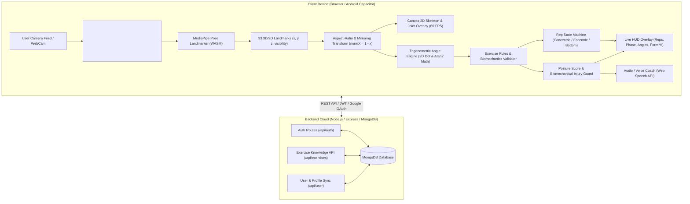

<div align="center">

# 🏋️‍♂️ The Gym Bro AI

### **Your Intelligent Real-Time Computer Vision Personal Trainer & Biomechanics Tracker**

[](https://react.dev/)
[](https://vitejs.dev/)
[](https://developers.google.com/mediapipe)
[](https://tailwindcss.com/)
[](https://nodejs.org/)
[](https://capacitorjs.com/)

<p align="center">
  <b>The Gym Bro AI</b> is a state-of-the-art web and mobile fitness application that turns your device's camera into an elite personal trainer. Powered by <b>Google MediaPipe's 33-point skeletal landmark detection</b> and real-time <b>biomechanical trigonometry</b>, it tracks your repetitions with precision, analyzes form at 60 FPS, and delivers instant audio/visual corrective feedback—all processed <b>100% locally on your device for absolute privacy</b>.
</p>

---

</div>

## 📑 Table of Contents

- [✨ Core Capabilities & Highlights](#-core-capabilities--highlights)
- [🎯 What This Application Does](#-what-this-application-does)
- [🏗️ System Architecture & Data Flow](#️-system-architecture--data-flow)
- [🔬 How Pose Tracking Works (Camera & 33 MediaPipe Landmarks)](#-how-pose-tracking-works-camera--33-mediapipe-landmarks)
  - [1. Video Stream Capture](#1-video-stream-capture)
  - [2. MediaPipe Pose Landmarker Pipeline](#2-mediapipe-pose-landmarker-pipeline)
  - [3. The 33 Skeletal Keypoints](#3-the-33-skeletal-keypoints)
  - [4. Coordinate Normalization & Video Mirroring Transform](#4-coordinate-normalization--video-mirroring-transform)
- [📐 Biomechanical Angle & Geometry Calculations](#-biomechanical-angle--geometry-calculations)
  - [1. 3-Point 2D Joint Angle Trigonometry](#1-3-point-2d-joint-angle-trigonometry)
  - [2. Segment Inclination Relative to Vertical](#2-segment-inclination-relative-to-vertical)
  - [3. Primary Joint Extractors](#3-primary-joint-extractors)
- [⚙️ Exercise Rules & Rep-Counting State Machines](#️-exercise-rules--rep-counting-state-machines)
  - [Squat Tracking Engine](#-squat-tracking-engine)
  - [Bicep Curl Tracking Engine](#-bicep-curl-tracking-engine)
  - [Bench Press Tracking Engine](#-bench-press-tracking-engine)
  - [Shoulder / Overhead Press](#-shoulder--overhead-press)
  - [Romanian Deadlift (RDL)](#-romanian-deadlift-rdl)
  - [Lat Pulldown & Pull-ups](#-lat-pulldown--pull-ups)
  - [Tricep Pushdown](#-tricep-pushdown)
  - [Universal / Generic Exercise Tracker](#-universal--generic-exercise-tracker)
- [📱 Complete Application Ecosystem](#-complete-application-ecosystem)
- [🛠️ Tech Stack](#️-tech-stack)
- [📁 Project Directory Structure](#-project-directory-structure)
- [🚀 Getting Started & Local Development](#-getting-started--local-development)
  - [Prerequisites](#prerequisites)
  - [1. Clone Repository](#1-clone-repository)
  - [2. Frontend Setup](#2-frontend-setup)
  - [3. Backend Setup](#3-backend-setup)
  - [4. Android Build via Capacitor](#4-android-build-via-capacitor)
- [💡 How to Use The App](#-how-to-use-the-app)
- [🔒 Privacy & Edge Compute Guarantee](#-privacy--edge-compute-guarantee)
- [🤝 Contributing & License](#-contributing--license)

---

## ✨ Core Capabilities & Highlights

| Feature | Description |
| :--- | :--- |
| 👁️ **Edge Computer Vision** | Real-time body pose estimation running at **60 FPS** entirely in the browser using WebAssembly & SIMD acceleration. |
| 🛡️ **Biomechanical Form Guard** | Real-time safety validation: detects **knee valgus (knees collapsing)**, **heel lift**, **excessive forward lumbar lean**, **elbow flare**, and **torso momentum swing**. |
| 🔢 **Deterministic State-Machine Rep Counter** | Prevents false positives and partial reps by tracking distinct movement states (e.g., *Stand &rarr; Descending &rarr; Bottom Depth &rarr; Ascending &rarr; Completed Rep*). |
| 🔊 **Voice Coaching & Live HUD** | Instant auditory cues via the Web Speech API and visual canvas HUD showing live joint angles, rep counter, form score (0–100%), and phase badges. |
| 📋 **Adaptive Workout Split Generator** | Generates scientifically backed **3, 4, 5, and 6-day splits** (PPL, Upper/Lower, Arnold Split, Full Body) personalized to athlete goals and experience levels. |
| 🔐 **Cross-Platform Authentication** | Google OAuth & JWT authentication supporting both Web browsers and native Android Capacitor builds. |
| 🔒 **100% Privacy-First** | Camera video streams never leave the client device; zero video data is uploaded to servers. |

---

## 🎯 What This Application Does

1. **Live Camera Pose Detection**: Opens the user's front or back camera, captures video frames, and renders a glowing skeletal wireframe over major anatomical joints.
2. **Exercise Guidance & Biomechanical Analysis**: Allows users to select any exercise from their customized workout plan or the library. When the user exercises, it calculates joint angles in real time.
3. **Smart Rep Counting**: Ensures reps are only counted when full range of motion (ROM) is achieved (e.g., squatting below parallel, fully locking out arms on presses).
4. **Form Correction & Coaching**: Flags risky lifting mechanics (e.g., knees caving inward on heavy squats, shoulders drifting forward on curls) and tells the lifter how to fix their posture immediately.
5. **Athlete Profile & Progress Hub**: Tracks workouts, weekly goals, body statistics, training experience, and splits.

---

## 🏗️ System Architecture & Data Flow



---

## 🔬 How Pose Tracking Works (Camera & 33 MediaPipe Landmarks)

### 1. Video Stream Capture
The browser requests access to the user's camera through the standard `navigator.mediaDevices.getUserMedia()` API:
```javascript
const stream = await navigator.mediaDevices.getUserMedia({
  video: {
    width: { ideal: 1280 },
    height: { ideal: 720 },
    facingMode: "user"
  },
  audio: false
});
videoRef.current.srcObject = stream;
```

### 2. MediaPipe Pose Landmarker Pipeline
We use `@mediapipe/tasks-vision` (v0.10.35) compiled to WebAssembly (WASM). Initialization downloads the optimized Float16 model bundle (`pose_landmarker_lite.task`):

```javascript
import { FilesetResolver, PoseLandmarker } from "@mediapipe/tasks-vision";

const vision = await FilesetResolver.forVisionTasks(
  "https://cdn.jsdelivr.net/npm/@mediapipe/tasks-vision/wasm"
);

const poseLandmarker = await PoseLandmarker.createFromOptions(vision, {
  baseOptions: {
    modelAssetPath: "https://storage.googleapis.com/mediapipe-models/pose_landmarker/pose_landmarker_lite/float16/latest/pose_landmarker_lite.task"
  },
  runningMode: "VIDEO",
  numPoses: 1
});
```

Every animation frame (~60 times per second), `detectForVideo(videoElement, performance.now())` outputs the normalized body coordinates.

### 3. The 33 Skeletal Keypoints
MediaPipe tracks **33 high-fidelity anatomical landmark points** representing the full human body:

```
                  0 - Nose
            1 - Left Eye Inner        4 - Right Eye Inner
            2 - Left Eye              5 - Right Eye
            3 - Left Eye Outer        6 - Right Eye Outer
               7 - Left Ear              8 - Right Ear
                  9 - Mouth Left        10 - Mouth Right
                        \              /
                   11 - Left Shldr   12 - Right Shldr
                       | \          / |
                       |  13 - L.Elb  14 - R.Elb
                       |   |          |   |
                       |  15 - L.Wri  16 - R.Wri
                       |  / \        / \  |
                   17/19/21           18/20/22 (Hands/Fingers)
                       |                  |
                   23 - Left Hip ---- 24 - Right Hip
                         \              /
                     25 - Left Knee  26 - Right Knee
                           \          /
                       27 - L.Ankle  28 - R.Ankle
                           /  \          /  \
                  29 - L.Heel 31-L.Toe  30-R.Heel 32-R.Toe
```

#### Key Landmarks Utilized by The Gym Bro AI:
| Index Range | Anatomical Group | Primary Keypoints & Numbers |
| :--- | :--- | :--- |
| `11, 12` | **Shoulders** | 11 (Left Shoulder), 12 (Right Shoulder) |
| `13, 14` | **Elbows** | 13 (Left Elbow), 14 (Right Elbow) |
| `15, 16` | **Wrists** | 15 (Left Wrist), 16 (Right Wrist) |
| `23, 24` | **Hips / Pelvis** | 23 (Left Hip), 24 (Right Hip) |
| `25, 26` | **Knees** | 25 (Left Knee), 26 (Right Knee) |
| `27, 28` | **Ankles** | 27 (Left Ankle), 28 (Right Ankle) |
| `29, 30` | **Heels** | 29 (Left Heel), 30 (Right Heel) |
| `31, 32` | **Foot Index / Toes** | 31 (Left Foot Index), 32 (Right Foot Index) |

### 4. Coordinate Normalization & Video Mirroring Transform
Because the user's camera feed is mirrored horizontally for a natural mirror experience (`transform: scaleX(-1)`), raw MediaPipe coordinates $x \in [0, 1]$ must be horizontally flipped ($1 - x$) and mapped to canvas dimensions accounting for CSS `object-fit: cover` cropping:

$$\text{normX} = 1 - \text{landmark.x}$$

```javascript
function getLandmarkCoords(lm, videoWidth, videoHeight, containerWidth, containerHeight) {
  const videoRatio = videoWidth / videoHeight;
  const containerRatio = containerWidth / containerHeight;
  const normX = 1 - lm.x; // Invert X for CSS scaleX(-1) mirror match

  let x, y;
  if (containerRatio > videoRatio) {
    const scale = containerWidth / videoWidth;
    const renderedHeight = videoHeight * scale;
    const offsetY = (renderedHeight - containerHeight) / 2;

    x = normX * containerWidth;
    y = (lm.y * renderedHeight) - offsetY;
  } else {
    const scale = containerHeight / videoHeight;
    const renderedWidth = videoWidth * scale;
    const offsetX = (renderedWidth - containerWidth) / 2;

    x = (normX * renderedWidth) - offsetX;
    y = lm.y * containerHeight;
  }
  return { x, y };
}
```

---

## 📐 Biomechanical Angle & Geometry Calculations

### 1. 3-Point 2D Joint Angle Trigonometry
To calculate the angle at joint vertex $B$ formed by segment $BA$ and segment $BC$:

```
        A (e.g., Shoulder)
       /
      /
     /
    B (e.g., Elbow - Vertex)
     \
      \
       \
        C (e.g., Wrist)
```

We compute the 2-argument arctangent ($\operatorname{atan2}$) difference between vectors $\vec{BA}$ and $\vec{BC}$:

$$\theta_{\text{rad}} = \operatorname{atan2}(C_y - B_y, C_x - B_x) - \operatorname{atan2}(A_y - B_y, A_x - B_x)$$

$$\theta_{\text{deg}} = |\theta_{\text{rad}}| \times \frac{180^\circ}{\pi}$$

$$\text{If } \theta_{\text{deg}} > 180^\circ \implies \theta_{\text{deg}} = 360^\circ - \theta_{\text{deg}}$$

```javascript
export function calculate2DAngle(A, B, C) {
  if (!A || !B || !C) return 180;
  
  let radians = Math.atan2(C.y - B.y, C.x - B.x) - Math.atan2(A.y - B.y, A.x - B.x);
  let angle = Math.abs((radians * 180.0) / Math.PI);
  
  if (angle > 180.0) {
    angle = 360.0 - angle;
  }
  return angle;
}
```

### 2. Segment Inclination Relative to Vertical
For checking forward torso lean, spinal flexion, or forearm tilt relative to gravity (the vertical axis):

$$\theta_{\text{vertical}} = \left| \operatorname{atan2}(\Delta x, \Delta y) \times \frac{180^\circ}{\pi} \right|$$

```javascript
export function calculateSegmentAngleRelativeToVertical(A, B) {
  if (!A || !B) return 0;
  const dx = B.x - A.x;
  const dy = B.y - A.y;
  return Math.abs(Math.atan2(dx, dy) * 180.0 / Math.PI);
}
```

### 3. Primary Joint Extractors
The engine automatically chooses the body side with higher landmark visibility confidence (`getBestVisibleSide`) and extracts:

- **Elbow Angle**: $\angle(\text{Shoulder}_{11/12}, \text{Elbow}_{13/14}, \text{Wrist}_{15/16})$
- **Knee Angle**: $\angle(\text{Hip}_{23/24}, \text{Knee}_{25/26}, \text{Ankle}_{27/28})$
- **Hip Angle**: $\angle(\text{Shoulder}_{11/12}, \text{Hip}_{23/24}, \text{Knee}_{25/26})$
- **Shoulder Angle**: $\angle(\text{Elbow}_{13/14}, \text{Shoulder}_{11/12}, \text{Hip}_{23/24})$
- **Ankle Angle**: $\angle(\text{Knee}_{25/26}, \text{Ankle}_{27/28}, \text{Heel}_{31/32})$
- **Torso Inclination**: Segment angle of $(\text{Shoulder}_{11/12} \to \text{Hip}_{23/24})$ relative to vertical axis.

---

## ⚙️ Exercise Rules & Rep-Counting State Machines

Every exercise uses a dedicated **Finite State Machine (FSM)** with biomechanical validation rules.

### 🏋️‍♂️ Squat Tracking Engine
- **Required Landmarks**: $11, 12, 23, 24, 25, 26, 27, 28, 29, 30, 31, 32$
- **State Machine Progression**:
  1. `stand`: Upright posture ($\text{Knee Angle} > 165^\circ$).
  2. `descending`: Knees bending, hips moving back and down ($\text{Knee Angle} < 155^\circ$).
  3. `bottom`: Femur parallel to floor or below ($\text{Knee Angle} < 95^\circ$).
  4. `ascending`: Concentric drive upward ($\text{Knee Angle} > 105^\circ$).
  5. `rep_complete`: Return to `stand` ($\text{Knee Angle} > 165^\circ$) $\to \text{Rep Count} + 1$.
- **Real-Time Biomechanical Safety Checks**:
  - **Knee Valgus (Inward Collapse)**: $\frac{|\text{Knee}_L.x - \text{Knee}_R.x|}{|\text{Ankle}_L.x - \text{Ankle}_R.x|} < 0.85 \implies$ *"Push knees out. Do not let them cave inward!"* (ACL injury guard).
  - **Heel Lift**: Evaluates vertical displacement between heel ($29/30$) and toes ($31/32$). If heels lift off the ground $\implies$ *"Keep your heels planted. Drive through your midfoot."*
  - **Torso Forward Lean**: If $\text{TorsoLean} > 40^\circ \implies$ *"Keep chest up. Avoid excessive forward lean."*

---

### 💪 Bicep Curl Tracking Engine
- **Required Landmarks**: $11, 12, 13, 14, 15, 16, 23, 24$
- **State Machine Progression**:
  1. `start` / `extended`: Arms extended in starting position ($\text{Elbow Angle} > 160^\circ$).
  2. `concentric`: Flexing bicep, lifting forearm ($\text{Elbow Angle} < 140^\circ$).
  3. `peak`: Peak contraction at top of movement ($\text{Elbow Angle} < 45^\circ$).
  4. `eccentric`: Controlled lowering phase ($\text{Elbow Angle} > 60^\circ$).
  5. `rep_complete`: Full extension achieved ($\text{Elbow Angle} > 155^\circ$) $\to \text{Rep Count} + 1$.
- **Biomechanical Form Guard**:
  - **Elbow Drift / Shoulder Swing**: If $\text{Shoulder Angle} > 25^\circ \implies$ *"Keep elbows pinned at your side. Don't drift forward."*
  - **Torso Swing Momentum**: If $\text{Torso Lean} > 15^\circ \implies$ *"Stand straight. Avoid leaning back to swing the weight."*

---

### 🛡️ Bench Press Tracking Engine
- **State Machine Progression**: `lockout` ($>155^\circ$) &rarr; `descending` &rarr; `bottom` ($<85^\circ$, barbell touches lower chest) &rarr; `ascending` &rarr; `rep_complete`.
- **Biomechanical Form Guard**:
  - **Elbow Flaring Check**: Verifies abduction angle stays between $45^\circ - 75^\circ$ (protects the rotator cuff from impingement).
  - **Wrist-Elbow Stacking**: Validates forearm remains vertical under load.

---

### 🚀 Other Supported Exercise Engines
- **Shoulder / Overhead Press**: Tracks clavicle start &rarr; overhead lockout ($>165^\circ$) + flags lower back hyperextension.
- **Romanian Deadlift (RDL)**: Monitors pure hip hinge ($\text{Hip Angle} < 110^\circ$) while maintaining stationary knee flexion ($150^\circ-165^\circ$) and neutral spinal angle.
- **Lat Pulldown / Pull-ups**: Overhead full stretch &rarr; scapular depression & contraction to clavicle level.
- **Tricep Pushdown**: Upper arm fixed perpendicular to floor &rarr; complete elbow lockout ($>155^\circ$).
- **Universal / Generic Tracker**: Adaptive ROM calibration for any other movement.

---

## 📱 Complete Application Ecosystem

```
├── 📊 Dashboard & Daily Tracker
│   ├── Workout plan quick view & today's target split
│   ├── Total completed workouts, weekly streak & exercise stats
│   └── Biometrics summary (Height, Weight, BMI, Target Level)
│
├── 📅 Smart Workout Split Page
│   ├── 3-Day Split (Full Body / Push-Pull-Legs)
│   ├── 4-Day Split (Upper / Lower Body Split)
│   ├── 5-Day Split (PPL + Upper / Lower)
│   ├── 6-Day Split (Push-Pull-Legs 2x Hypertrophy)
│   └── Interactive Exercise Cards with Video Tracking Launchers
│
├── 🎥 Full-Screen AI Vision Gym Camera
│   ├── 60 FPS Skeletal Wireframe & Node Visualizer
│   ├── Live Biomechanical Angle Overlay
│   ├── Real-Time HUD (Rep Count, Movement Phase, Form Score)
│   └── Voice Feedback & Audio Sound Effects
│
├── 👤 Athlete Profile & Goal Setup
│   ├── Goal Selection (Hypertrophy, Strength, Weight Loss, Endurance)
│   ├── Training Experience & Weekly Frequency Tuning
│   └── Body Metrics Tracking (Weight, Height, Age, Gender)
│
└── 🔐 Authentication & Cloud Sync
    ├── Google OAuth (Web One-Tap + Android Native)
    └── Secure JWT Email/Password Authentication
```

---

## 🛠️ Tech Stack

### Frontend
- **Framework**: [React 19](https://react.dev/) + [Vite 8](https://vitejs.dev/)
- **Styling**: TailwindCSS v4 + Custom Glassmorphic Dark UI Design System
- **Icons**: [Lucide React](https://lucide.dev/)
- **Routing**: [React Router DOM v7](https://reactrouter.com/)
- **Audio Feedback**: Web Speech API (`speechSynthesis`) + Web Audio API oscillators

### AI & Computer Vision
- **Vision Engine**: [@mediapipe/tasks-vision](https://www.npmjs.com/package/@mediapipe/tasks-vision) v0.10.35
- **Model**: `pose_landmarker_lite.task` (Float16 Quantized, WebAssembly + SIMD)
- **Math Engine**: Custom Vector & Trigonometric 2D Dot/Atan2 Biomechanics Engine

### Mobile
- **Runtime**: [@capacitor/core](https://capacitorjs.com/) v8.4 (Android native wrapper)
- **Native Auth**: `@codetrix-studio/capacitor-google-auth`

### Backend
- **Server**: [Node.js](https://nodejs.org/) + [Express.js](https://expressjs.com/)
- **Database**: [MongoDB](https://www.mongodb.com/) with [Mongoose](https://mongoosejs.com/)
- **Auth**: [jsonwebtoken (JWT)](https://www.npmjs.com/package/jsonwebtoken) + [google-auth-library](https://www.npmjs.com/package/google-auth-library)

---

## 📁 Project Directory Structure

```
the-gym-bro/
├── index.html                   # HTML entry point with viewport & Google API fonts
├── package.json                 # Frontend dependencies & scripts
├── vite.config.js               # Vite bundler & TailwindCSS plugin config
│
├── server/                      # Node.js Express Backend
│   ├── server.js                # Express app entry point & route registration
│   ├── package.json             # Backend dependencies
│   ├── controllers/             # Auth, user, and workout controllers
│   ├── middleware/              # JWT verification middleware
│   ├── models/                  # Mongoose models (User, WorkoutPlan, Exercise)
│   ├── routes/                  # REST endpoints (/api/auth, /api/user, etc.)
│   └── scripts/seed.js          # Database seed script for exercise library
│
├── src/                         # React Frontend Application
│   ├── App.jsx                  # Main application routes & context providers
│   ├── main.jsx                 # React root renderer
│   ├── index.css                # Custom design system & animations
│   │
│   ├── components/              # Reusable UI & Computer Vision Components
│   │   ├── posedet.jsx          # MediaPipe Pose Landmarker & HUD canvas overlay
│   │   ├── infopage.jsx         # Exercise details modal & tracking launcher
│   │   ├── cameraupload.jsx     # Video/camera upload fallback handler
│   │   ├── Navbar.jsx           # Global navigation bar
│   │   ├── AuthModal.jsx        # Google OAuth & Email login modal
│   │   └── ToastNotification.jsx# Global toast notification alert
│   │
│   ├── pose/                    # Core Computer Vision & Biomechanics Math
│   │   ├── angleUtils.js        # 2D atan2 trigonometry & joint angle calculations
│   │   ├── landmarkUtils.js     # Landmark coordinate normalization & validators
│   │   ├── postureEvaluator.js  # Biomechanical posture & penalty scorer
│   │   ├── repCounter.js        # Rep coordinator & state-machine executor
│   │   └── feedbackEngine.js    # Audio & HUD feedback dispatcher
│   │
│   ├── exerciseRules/           # Individual Biomechanical Exercise Rules
│   │   ├── squat.js             # Squat depth, knee valgus & heel lift rules
│   │   ├── bicepCurl.js         # Bicep curl range, elbow pinning & sway rules
│   │   ├── benchPress.js        # Bench press lockout, touch & flare rules
│   │   ├── shoulderPress.js     # Overhead press lockout & spinal rules
│   │   ├── romanianDeadlift.js  # RDL hip hinge & neutral back rules
│   │   ├── latPulldown.js       # Lat pulldown reach & contraction rules
│   │   ├── tricepPushdown.js    # Tricep extension lockout rules
│   │   ├── generic.js           # Adaptive dynamic baseline tracker
│   │   └── index.js             # Exercise rule resolver
│   │
│   ├── context/                 # Global React State Contexts
│   │   ├── AuthContext.jsx      # Authentication & user profile state
│   │   └── WorkoutContext.jsx   # Active workout routine & progress state
│   │
│   ├── pages/                   # Main Page Views
│   │   ├── DashboardPage.jsx    # Athlete dashboard & workout launcher
│   │   ├── WorkoutPlanPage.jsx  # Interactive workout split routines
│   │   ├── ProfilePage.jsx      # Athlete bio, stats & split customization
│   │   ├── SettingsPage.jsx     # App configuration & preferences
│   │   └── CompleteProfilePage.jsx # Initial onboarding & goal setup
│   │
│   └── data/                    # Exercise catalog, descriptions & tips
│       └── exerciseDetails.js
```

---

## 🚀 Getting Started & Local Development

### Prerequisites
- **Node.js**: v18.0.0 or later ([Download Node.js](https://nodejs.org/))
- **MongoDB**: Local MongoDB instance or [MongoDB Atlas connection URI](https://www.mongodb.com/atlas)
- **Google OAuth Client ID** (Optional for Google login)

### 1. Clone Repository
```bash
git clone https://github.com/gouravgaba-git/Gym-bro-AI.git
cd Gym-bro-AI
```

### 2. Frontend Setup
Install frontend dependencies:
```bash
npm install
```

Create a `.env` file in the project root:
```env
VITE_API_BASE_URL=http://localhost:5000
VITE_GOOGLE_CLIENT_ID=your_google_client_id_here
```

Start the Vite development server:
```bash
npm run dev
```
The frontend will run at `http://localhost:5173`.

### 3. Backend Setup
Open a new terminal and navigate to the `server/` directory:
```bash
cd server
npm install
```

Create a `.env` file in the `server/` directory:
```env
PORT=5000
MONGO_URI=mongodb://127.0.0.1:27017/gymbro
JWT_SECRET=your_super_secret_jwt_key
GOOGLE_CLIENT_ID=your_google_client_id_here
```

Seed the exercise database (optional but recommended):
```bash
npm run seed
```

Start the backend server:
```bash
npm run dev
```
The backend API will run at `http://localhost:5000`.

### 4. Android Build via Capacitor
To build and test the native Android application:
```bash
# Build the production frontend assets
npm run build

# Sync web assets to Android project
npx cap sync android

# Open project in Android Studio
npx cap open android
```

---

## 💡 How to Use The App

1. **Sign In or Explore as Guest**:
   - Log in with Google or create an account to save your workout history, or explore the features directly.
2. **Configure Your Profile**:
   - Head to **Profile** or **Complete Profile** to set your primary goal (*Muscle Growth, Strength, Weight Loss*), workout days per week (3–6 days), and training level (*Beginner, Intermediate, Advanced*).
3. **Choose a Workout Split**:
   - Navigate to **Workout Plan** to see your tailored routine (e.g., Push Day, Pull Day, Leg Day).
4. **Launch AI Pose Detection**:
   - Click on any exercise card (e.g., *Barbell Squat* or *Dumbbell Bicep Curl*) and select **Start Workout / AI Camera**.
5. **Position Your Device**:
   - Place your phone or laptop 6–8 feet away so your full body (head to toes) is visible in the frame.
   - Ensure the room is well-lit for optimal landmark detection.
6. **Perform Your Set**:
   - Listen to the real-time voice coach and watch the HUD.
   - The HUD will show:
     - **Rep Count**: Increments automatically upon completing a valid repetition.
     - **Phase**: Indicates `STAND`, `DESCENDING`, `BOTTOM`, `ASCENDING`, or `EXTENSION`.
     - **Form Score (0–100%)**: Highlights real-time posture quality.
     - **Corrective Warnings**: Displays on-screen tips and voice alerts if form degrades.

---

## 🔒 Privacy & Edge Compute Guarantee

Your privacy is paramount. **The Gym Bro AI** operates using a **100% Client-Side Edge Inference** architecture:
- 🚫 **No Video Recording Uploads**: Camera frames are processed frame-by-frame inside your device's browser memory (RAM) and immediately discarded.
- 🚫 **No Server Processing of Video**: Video data is never transmitted over the internet or saved to any cloud storage.
- ⚡ **Ultra-Low Latency**: Client-side execution eliminates network lag, ensuring instantaneous 60 FPS rep counting and feedback.

---

## 🤝 Contributing & License

Contributions, feature requests, and feedback are always welcome! Feel free to open an issue or submit a Pull Request.

Built with ❤️ by [Gourav Gaba](https://github.com/gouravgaba-git) for athletes and fitness enthusiasts worldwide.
